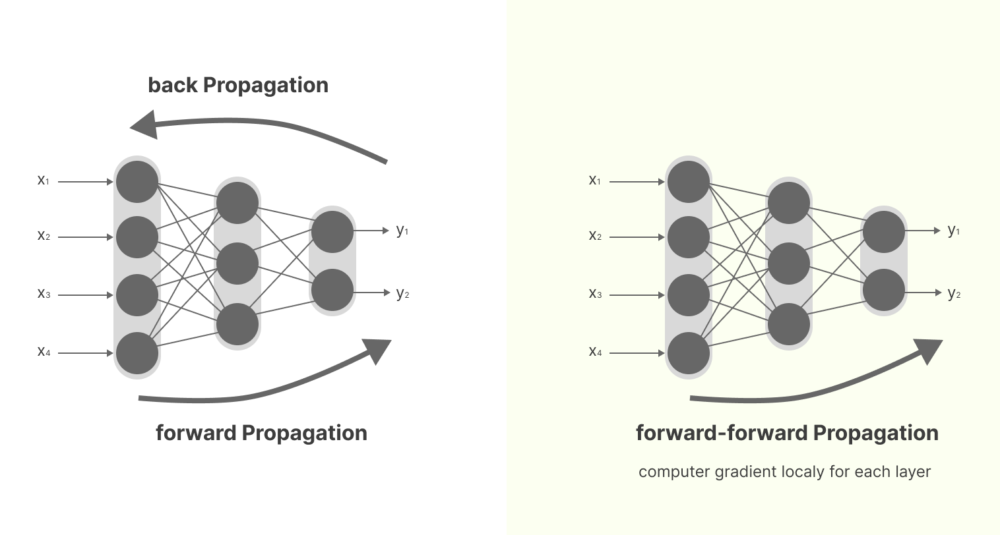
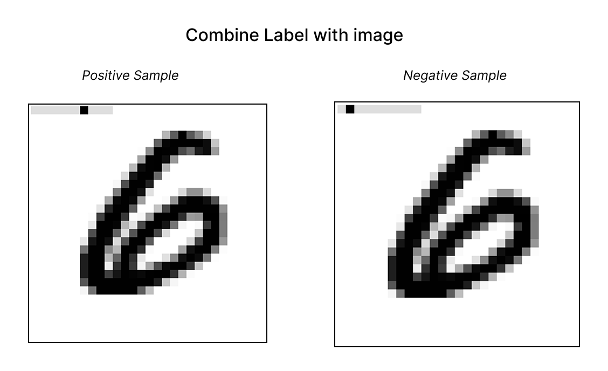
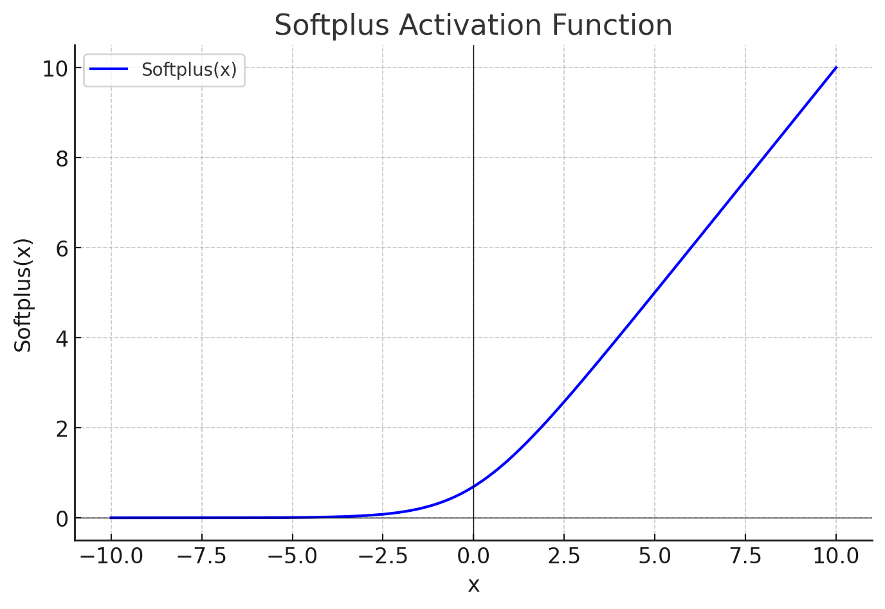

# Forward-Forward-Algorithm

the algorithm was produced by hinton in 2022 , using two forward passes to minic the learning in the cortex at sleeping.

[Forward Forward Algorithm](https://arxiv.org/pdf/2212.13345)

use contrastive learning , positive and negative pass including label of image correctly in positive and wrong label in negative images.

      

- use 2 layer (512) network with softplus function (smoother than ReLU)

  

## Result :

  

### Read More :

- <https://github.com/visvig/forward-forward-algorithm>
- <https://github.com/EscVM/EscVM_YT/blob/master/Notebooks/2%20-%20PT1.X%20DeepAI-Quickie/pt_1_forward_forward_alg.ipynb>
- <https://github.com/mpezeshki/pytorch_forward_forward>
- <https://github.com/cozheyuanzhangde/Forward-Forward>
